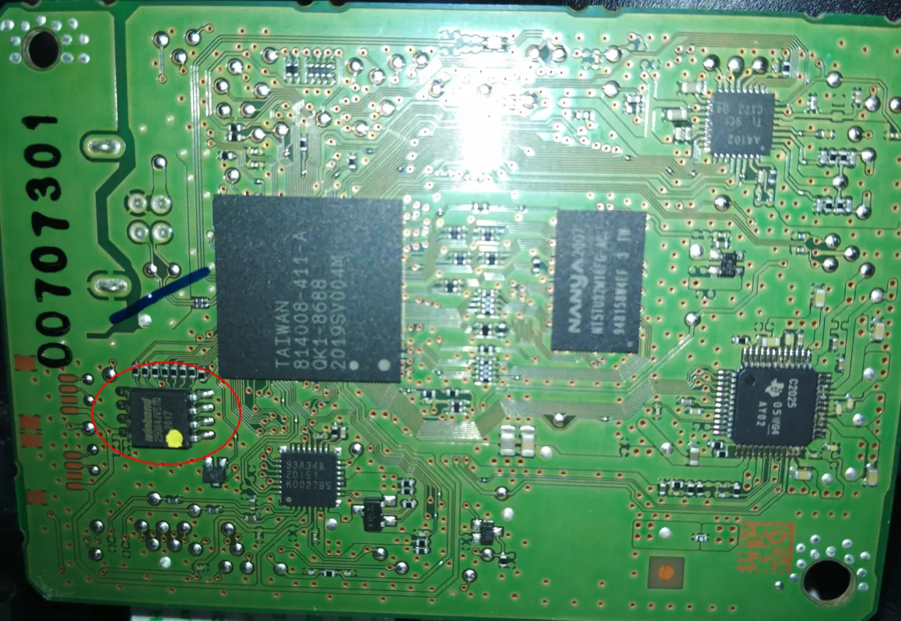

<div align="center">

# Canon Pixma TS3100 series Password Recovery

A project to extract sensitive information from EEPROMs 
of Canon Pixma TS3100 series / TS3150 (at least) printers.

</div>

See [HP-Deskjet-Password-Recovery](https://github.com/ysard/HP-Deskjet-Password-Recovery)
for a similar project about HP printers.

## :star: Features

TL;DR: No encryption for the Wi-Fi credentials on the EEPROM :thumbsup: :poop:.

- Recover the serial number and the network name of the printer
- Recover the ESSID and the password of the Wi-Fi access point configured on the printer
- Recover the ESSID and the password of the Direct wireless access point

The password of the HTTP server interface remains unknown.
It is hashed with SHA256 before being sent to the server, and then probably salted and rehashed.

The following offsets are serious candidates:
`0x000001b0, 0x000101b0, 0x000201b0`

## Targeted EEPROM

On the reverse side of the PCB, dump the content of the EEPROM named ``.
It's an Winbond EEPROM of the type W25Q64JVSIQ, using the protocol SPI.

[](./assets/pcb_eeprom_small.webp)

Use the following command to read the EEPROM with a CH341 USB adapter:

    $ flashrom -p ch341a_spi --progress -c "W25Q64JV-.Q" -r W25Q64JVSIQ.bin

## Usage

```
$ python canon_pixma_recovery.py my_eeprom_dump.bin
```

## Example

```
$ python ./canon_pixma_recovery.py W25Q64JVSIQ.bin 
File: W25Q64JVSIQ.bin
1.1. PRODUCT_NAME: TS3100 series
1.3. SERIAL_NB: AFLE83204
3.2.4. MAC_ADDR: 349F7B30FF96
3.2.12. IP_ADDR: 192.168.1.175, 192.168.1.33
 NETWORK_NAME: 30FF96000000.local.
3.2.6. AP_ESSID: FakeAP
 AP_PASSWORD: 00000000000000000000
3.3.3. DIRECT_ESSID: 30FF96-TS3100series
3.3.4. DIRECT_PASS: 00000000000000000000
3.3.9. DIRECT_IP_ADDR: 192.168.114.1
5.1. PRINTER_NAME: 30FF96000000
```

## License

Released under the GPL (General Public License).
